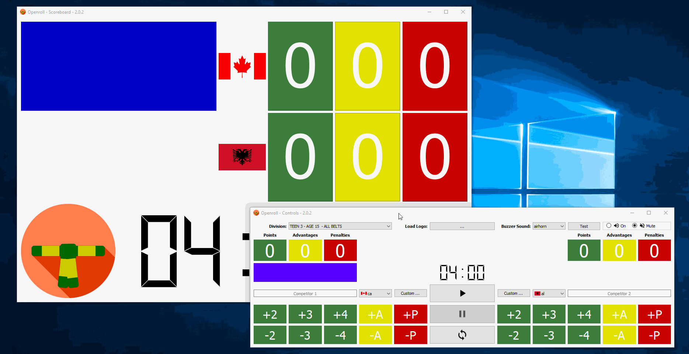

NOTE: transition to Qt 6 underway, will take to end of 2021 at least (Qt 6 removed 'multimedia' library this project needs, will not be
put back in until September 2021 and Qt 6.2 LTS is out).

# Openroll

 

## Description

Openroll is a free and open-source scoreboard and match timer for IBJJF-rules
Brazilian Jiu-Jitsu. It is not affiliated with the IBJJF in any way.

## Features

* Dual window system keeps buttons and controls on one screen for scorekeeper and puts critical match details on the other, to be displayed on external monitor.
* Offline (some gyms/venues do not or cannot use wifi/internet).
* Choose flag per competitor or load your own image, e.g., gym logo.
* Follows IBJJF divisions and timings, simply select from division dropdown and all rules are applied.
* Load custom gym/tourney logo in bottom-left corner to represent branding.
* Choose from several buzzer sounds or mute buzzer entirely.
* Dynamic name entry fields update on-the-fly.
* Dynamic scoreboard display scales to any size.
* Open-source licensing allows you to make modifications and builds as you
see fit, no vendor lock-in

## Installation (Windows-only)

Although only packaged for Windows 7+, it has been tested and ran on OS X and Ubuntu 18.04.x during
development.

## Download

Link to Sourceforge direct download for Windows:

## Licenses

This file is part of Openroll.

Copyright (C) 2019 C.D.MacEachern <craigmaceachern@fastmail.com>

See LICENSES.txt file for attributions and licensing details. LGPLv3 is provided as 'lgpl.txt',
and GPLv3 is provided as 'gpl.txt' with the installation.
